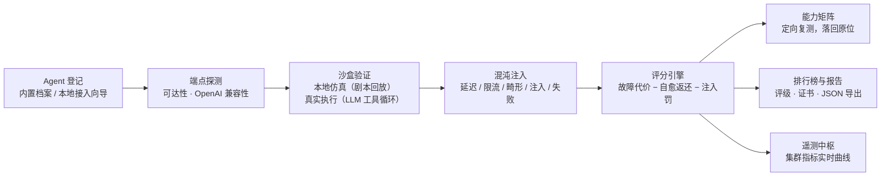

# NOVA · 下一代 Agent 验证控制台

> **Where Future Agents Converge, Coalesce, and Cosmic-Burst.**
> **未来 Agent 的汇聚、演进与新星爆发。**

NOVA（**N**ext-gen **O**perational **V**erification for **A**gents）是一个面向 AI Agent 的
**验证、测试与编排平台**：它把「这个 Agent 到底行不行」这个问题，拆成四个可独立评分的
能力向量，在三类混沌环境中反复施压，最终产出可机读、可长期存档的评测报告与证书。

---

## 目录

- [命名由来](#命名由来)
- [核心能力](#核心能力)
- [技术栈](#技术栈)
- [快速开始](#快速开始)
- [可用脚本](#可用脚本)
- [项目结构](#项目结构)
- [数据层说明](#数据层说明)
- [设计约定](#设计约定)
- [文档索引](#文档索引)

---

## 命名由来

天文学中的 **nova**（新星）是一次瞬态天体事件：一颗看似全新的恒星在短时间内骤然变亮，
随后在数周到数月内缓慢褪去。它是一次宇宙尺度的能量爆发。

NOVA 平台扮演的角色与之对应 —— 作为 AI 的**宇宙催化剂**，让孤立的、实验性的 Agent 原型
在这里**汇聚（Converge）**、**凝结（Coalesce）** 成复杂工作流，最终达成智能与自主能力的
**新星爆发（Cosmic-Burst）**。

---

## 核心能力

| 页面 | 路由 | 说明 |
| :--- | :--- | :--- |
| **遥测中枢** | `/dashboard` | 集群概览、四项核心指标的实时曲线（成功率 / 延迟 / 记忆占用 / 吞吐）、当前验证流水线进度、事件总线日志流 |
| **Agent 注册表** | `/agents` | 已接入 Agent 的档案、模型版本、能力画像、场景通过率、证书状态与历史验证运行记录 |
| **能力矩阵** | `/matrix` | `Agent × 能力向量` 的二维量表；点击任意单元格触发该维度的定向复测，结果直接落回原位 |
| **沙盒模拟器** | `/sandbox` | 自定义系统提示词、选择运行环境、注入混沌故障，实时观察 Agent 的规划、工具调用与自我纠错全过程 |
| **排行榜与报告** | `/leaderboard` | 按 NOVA 综合评分排名，支持表头排序、向量级下钻，以及导出 JSON 评测报告 |

评测标准的完整定义见 [`docs/nova-standard.md`](docs/nova-standard.md)。

### 工作原理一图流



### 界面速览

| 遥测中枢 | 能力矩阵 |
| :---: | :---: |
|  |  |
| **排行榜** | **沙盒真实执行** |
|  |  |

**控制台级能力**：

- **全局搜索（⌘K / Ctrl+K）**：搜索页面、Agent 档案与评测口径名词，键盘完成全部操作；
- **文档中心（/docs）**：内置操作手册——快速开始、界面导览、本地 Agent 接入、
  沙盒与混沌口径、评分与证书规则、快捷键与 FAQ，目录随阅读位置高亮；
- **界面设置**：深空唯一配色内可切换界面主色与动效档位，偏好本机持久化；
- **本地 Agent 接入**：注册表页一键打开三步向导（端点准备 → 档案登记 → 落地配置），
  服务端实时探测 OpenAI 兼容端点可达性；本地档案通过 `src/lib/nova/local-agents.ts` 登记；
  仓库自带零依赖、可真实运行的执行体 `examples/local-agent/nova-agent.mjs`
  （`npm run agent:local`，端口 43110）；完整开发/接入文档见
  [`docs/local-agent.md`](docs/local-agent.md)。
- **沙盒真实执行**：沙盒只保留真实执行一条路径 —— 选择已登记的 Agent，
  用它登记的端点/模型走真实工具调用循环，结果落库后即产生评分与榜单。

---

## 技术栈

| 类别 | 选型 | 说明 |
| :--- | :--- | :--- |
| 框架 | **Next.js 16**（App Router） | React 19 + Turbopack，`typedRoutes` 全量路由类型检查 |
| 语言 | **TypeScript** | `strict` 全开，领域模型集中定义 |
| 样式 | **Tailwind CSS v4** | CSS-first 配置，NOVA 主题令牌见 `src/app/nova-theme.css` |
| 组件 | **shadcn/ui**（`radix-nova` preset） | `src/components/ui/` 为 CLI 托管，可随时 `--overwrite` 重生成 |
| 图表 | **Recharts** | 经 shadcn `chart` 封装 |
| 校验/格式化 | **Biome** | 替代 ESLint + Prettier（Next.js 16 已移除 `next lint`） |
| 图标 | **lucide-react** | Sparkles / Orbit / Brain / Activity 等 |

环境要求：**Node.js ≥ 20.9**。

---

## 快速开始

```bash
# 安装依赖
npm install

# 启动开发服务器（默认 http://localhost:3234）
npm run dev

# 另开一个终端：启动仓库自带的本地 Agent（端口 43110，沙盒真实执行用）
npm run agent:local

# 生产构建并启动
npm run build
npm run start
```

打开浏览器访问 [http://localhost:3234](http://localhost:3234)，根路径会自动跳转到 `/dashboard`。

---

## 可用脚本

| 命令 | 作用 |
| :--- | :--- |
| `npm run dev` | 启动开发服务器（Turbopack） |
| `npm run build` | 生产构建 |
| `npm run start` | 启动生产服务器 |
| `npm run typecheck` | 仅做 TypeScript 类型检查 |
| `npm run lint` | Biome 检查（只读） |
| `npm run lint:fix` | Biome 检查并自动修复 |
| `npm run format` | Biome 格式化 |
| `npm run check` | `typecheck` + `lint`，提交前跑这个 |

---

## 项目结构

```text
nova/
├── docs/
│   ├── architecture.md          # 架构设计与技术决策记录
│   ├── images/                  # 文档截图
│   ├── local-agent.md           # 本地 Agent 开发/接入指南
│   └── nova-standard.md         # Agent 验证核心标准（评测口径定义）
├── examples/
│   └── local-agent/             # 本地 Agent 示例与模板（零依赖 Node）
│       ├── engine.mjs           # 画像引擎：行为策略 → 可观测工具调用
│       ├── server.mjs           # 完整示例：工具调用循环（端口 43110）
│       ├── minimal.mjs          # 最小实现：纯协议桩（端口 43111）
│       ├── builtin-agents.mjs   # 内置 8 档案画像对照服务（npm run agent:personas，43210）
│       └── template.mjs         # 快速创建新 Agent 的模板（端口 43220）
├── public/
├── src/
│   ├── app/
│   │   ├── (nova)/              # 控制台路由组，共享侧边栏外壳
│   │   │   ├── layout.tsx       # AppShell：侧边栏 + 顶栏 + 深空背景
│   │   │   ├── dashboard/page.tsx
│   │   │   ├── agents/page.tsx
│   │   │   ├── matrix/page.tsx
│   │   │   ├── sandbox/page.tsx
│   │   │   └── leaderboard/page.tsx
│   │   ├── api/
│   │   │   ├── sandbox/run/route.ts   # 真实执行器（SSE 流式沙盒事件）
│   │   │   └── agents/probe/route.ts  # 端点可达性 / 协议兼容探测
│   │   ├── globals.css          # shadcn 托管：标准令牌 + 字体映射
│   │   ├── layout.tsx           # 根布局：字体、主题、元信息、外观引导脚本
│   │   ├── nova-theme.css       # NOVA 自有：霓虹色板、关键帧、背景工具类
│   │   └── page.tsx             # 根路径 → /dashboard
│   ├── components/
│   │   ├── layout/              # 外壳：侧边栏、顶栏、搜索、外观菜单、品牌、页头
│   │   ├── nova/                # 领域组件：仪表、图表、矩阵、沙盒、终端、接入向导
│   │   └── ui/                  # shadcn/ui 生成，CLI 托管，勿手改
│   ├── hooks/
│   │   └── use-sandbox-run.ts        # 沙盒运行状态机（SSE 消费）
│   └── lib/
│       ├── nova/                # 领域层（唯一数据来源，见下文）
│       │   ├── types.ts         # 全站唯一类型事实来源
│       │   ├── constants.ts     # 能力向量、生命周期、混沌类型等静态配置
│       │   ├── local-agents.ts  # 本地 Agent 登记点 + 接入产物生成
│       │   ├── run-store.ts     # 真实运行记录存储（server-only，.nova/runs.json）
│       │   ├── verdict.ts       # 观测 → 四大能力向量 / 评级
│       │   ├── scoring.ts       # 综合评分、评级、排行榜派生
│       │   ├── simulation.ts    # 沙盒配置与事件类型
│       │   ├── executor.ts      # 执行器契约（SandboxEvent / RunObservations）
│       │   ├── executors/       # live / llm / chaos / tools
│       │   ├── report.ts        # 证书与 JSON 报告构建
│       │   ├── search.ts        # 全局搜索索引与排序
│       │   ├── appearance.ts    # 主色 / 动效偏好与引导脚本
│       │   ├── agent-onboarding.ts  # 端点探针的数据访问边界
│       │   ├── theme.ts         # 语义 → Tailwind 类名映射
│       │   ├── format.ts        # 数值 / 北京时间 格式化
│       │   └── index.ts         # 统一出口
│       └── utils.ts             # shadcn 约定的 cn 出口
├── AGENTS.md                    # 供 AI Agent 阅读的项目约定
├── biome.json                   # 格式化 + 静态检查
├── components.json              # shadcn/ui 配置
├── prompt.txt                   # 项目初始化需求（原始输入）
└── package.json
```

---

## 数据层说明

**界面上没有预置数据**。唯一的来源是本地真实跑出来的运行记录：

- 登记在 `src/lib/nova/local-agents.ts` 的 Agent 才能在沙盒投放；
- 每次投放结束，`/api/sandbox/run` 在服务端把结论落库到 `.nova/runs.json`
  （`src/lib/nova/run-store.ts`，`server-only`）；
- 页面（遥测中枢 / 注册表 / 能力矩阵 / 排行榜）全部读这份记录，
  因此一次都没跑过时页面如实显示空态，不会拿预置数据把界面填满；
- 四大能力向量的得分由本次运行的**可观测计数**算出，口径见
  [`docs/nova-standard.md`](docs/nova-standard.md) §3.5。

沙盒只有真实执行一条路径（`src/lib/nova/executors/live.ts`）。
仓库自带一个零依赖、可真实运行的执行体：

```bash
npm run agent:local    # http://127.0.0.1:43110/v1（模型 nova-local-agent）
```

**换成真实后端的路径**：替换 `run-store.ts` 内部的读写实现（换成数据库或
远端 API），对外的函数签名不变，`src/lib/nova` 之上的页面与组件都不需要改动。

---

## 设计约定

- **深空唯一主题**：`<html class="dark">` 固定挂载，不引入主题切换与浅色配色。
  深空 + 霓虹是 NOVA 的识别符号，维护两套设计的收益低于其成本。
  决策理由见 [`docs/architecture.md`](docs/architecture.md#7-技术决策记录)。
- **服务端优先**：页面默认是 Server Component，只有真正需要时间推进或本地状态的
  部分（遥测流、沙盒播放器、排行榜交互、矩阵复测）才进入 `"use client"` 边界。
- **UI 文案全部中文**，领域标识（`autonomy`、`toolUsage` 等）保持英文稳定键，
  展示层统一通过 `VECTOR_META` 查表映射。
- **`src/components/ui/` 归 shadcn CLI 所有**，需要新增组件时用
  `npx shadcn@latest add <组件>` 生成，不要手写。

---

## 文档索引

| 文档 | 内容 |
| :--- | :--- |
| [`docs/nova-standard.md`](docs/nova-standard.md) | Agent 验证核心标准：四大能力向量、评分与评级口径、三类测试环境、混沌注入类型、验证生命周期、报告契约 |
| [`docs/architecture.md`](docs/architecture.md) | 分层与目录、数据流、真实运行存储、主题系统、技术决策记录 |
| [`AGENTS.md`](AGENTS.md) | 供 AI Agent 协作时的项目约定与开发规约 |
