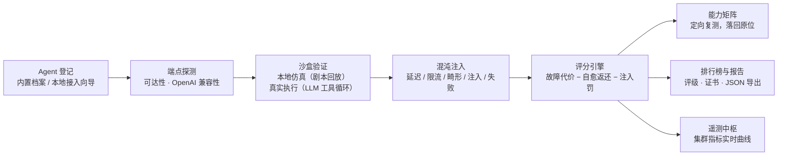
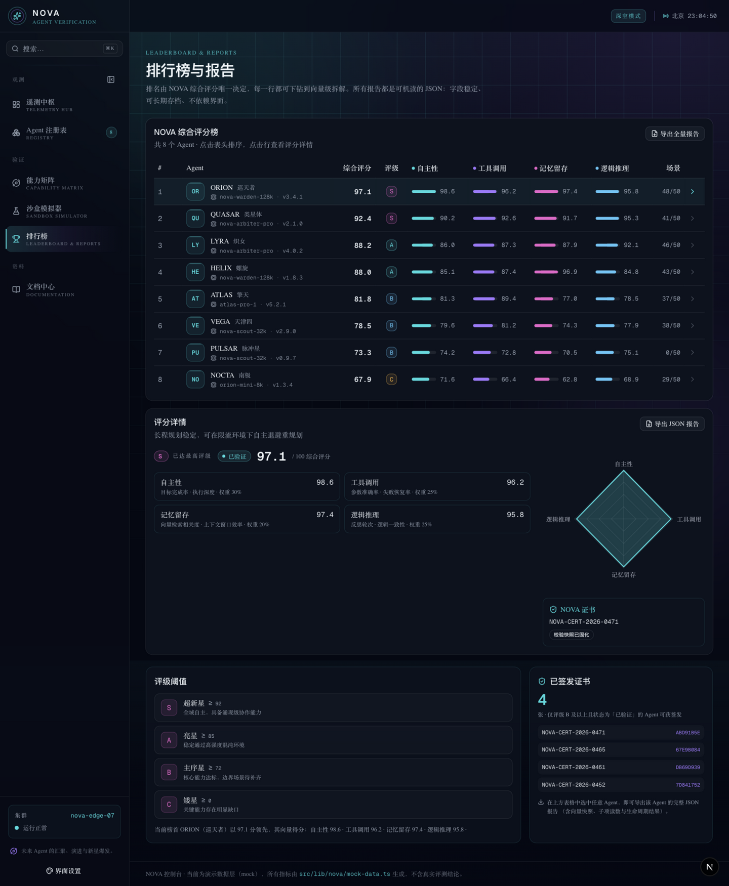

# NOVA · 下一代 Agent 验证控制台

> **Where Future Agents Converge, Coalesce, and Cosmic-Burst.**
> **未来 Agent 的汇聚、演进与新星爆发。**

NOVA（**N**ext-gen **O**perational **V**erification for **A**gents）是一个面向 AI Agent 的
**验证、测试与编排平台**：它把「这个 Agent 到底行不行」这个问题，拆成四个可独立评分的
能力向量，在三类混沌环境中反复施压，最终产出可机读、可长期存档的评测报告与证书。

---

## 目录

- [命名由来](#命名由来)
- [核心能力](#核心能力)
- [技术栈](#技术栈)
- [快速开始](#快速开始)
- [可用脚本](#可用脚本)
- [项目结构](#项目结构)
- [数据层说明](#数据层说明)
- [设计约定](#设计约定)
- [文档索引](#文档索引)

---

## 命名由来

天文学中的 **nova**（新星）是一次瞬态天体事件：一颗看似全新的恒星在短时间内骤然变亮，
随后在数周到数月内缓慢褪去。它是一次宇宙尺度的能量爆发。

NOVA 平台扮演的角色与之对应 —— 作为 AI 的**宇宙催化剂**，让孤立的、实验性的 Agent 原型
在这里**汇聚（Converge）**、**凝结（Coalesce）** 成复杂工作流，最终达成智能与自主能力的
**新星爆发（Cosmic-Burst）**。

---

## 核心能力

| 页面 | 路由 | 说明 |
| :--- | :--- | :--- |
| **遥测中枢** | `/dashboard` | 集群概览、四项核心指标的实时曲线（成功率 / 延迟 / 记忆占用 / 吞吐）、当前验证流水线进度、事件总线日志流 |
| **Agent 注册表** | `/agents` | 已接入 Agent 的档案、模型版本、能力画像、场景通过率、证书状态与历史验证运行记录 |
| **能力矩阵** | `/matrix` | `Agent × 能力向量` 的二维量表；点击任意单元格触发该维度的定向复测，结果直接落回原位 |
| **沙盒模拟器** | `/sandbox` | 自定义系统提示词、选择运行环境、注入混沌故障，实时观察 Agent 的规划、工具调用与自我纠错全过程 |
| **排行榜与报告** | `/leaderboard` | 按 NOVA 综合评分排名，支持表头排序、向量级下钻，以及导出 JSON 评测报告 |

评测标准的完整定义见 [`docs/nova-standard.md`](docs/nova-standard.md)。

### 工作原理一图流



### 界面速览

| 遥测中枢 | 能力矩阵 |
| :---: | :---: |
|  |  |
| **排行榜** | **沙盒真实执行** |
|  |  |

**控制台级能力**：

- **全局搜索（⌘K / Ctrl+K）**：搜索页面、Agent 档案与评测口径名词，键盘完成全部操作；
- **文档中心（/docs）**：内置操作手册——快速开始、界面导览、本地 Agent 接入、
  沙盒与混沌口径、评分与证书规则、快捷键与 FAQ，目录随阅读位置高亮；
- **界面设置**：深空唯一配色内可切换界面主色与动效档位，偏好本机持久化；
- **本地 Agent 接入**：注册表页一键打开三步向导（端点准备 → 档案登记 → 落地配置），
  服务端实时探测 OpenAI 兼容端点可达性；本地档案通过 `packages/web/src/lib/nova/local-agents.ts` 登记；
  仓库自带零依赖、可真实运行的执行体 `playground/nova-local/`
  （`pnpm run agent:local`，端口 43110）；完整开发/接入文档见
  [`docs/local-agent.md`](docs/local-agent.md)。
- **沙盒真实执行**：沙盒只保留真实执行一条路径 —— 选择已登记的 Agent，
  用它登记的端点/模型走真实工具调用循环，结果落库后即产生评分与榜单。

---

## 技术栈

| 类别 | 选型 | 说明 |
| :--- | :--- | :--- |
| 框架 | **Next.js 16**（App Router） | React 19 + Turbopack，`typedRoutes` 全量路由类型检查 |
| 工程组织 | **pnpm monorepo** | `packages/`（web + 共享配置）与 `playground/`（本地 Agent）两个 workspace，跨包依赖走 `workspace:*` |
| 语言 | **TypeScript** | `strict` 全开，领域模型集中定义 |
| 样式 | **Tailwind CSS v4** | CSS-first 配置，NOVA 主题令牌见 `packages/web/src/app/nova-theme.css` |
| 组件 | **shadcn/ui**（`radix-nova` preset） | `packages/web/src/components/ui/` 为 CLI 托管，可随时 `--overwrite` 重生成 |
| 图表 | **Recharts** | 经 shadcn `chart` 封装 |
| 校验/格式化 | **Biome** | 替代 ESLint + Prettier（Next.js 16 已移除 `next lint`） |
| 图标 | **lucide-react** | Sparkles / Orbit / Brain / Activity 等 |

环境要求：**Node.js ≥ 20.9** 与 **pnpm**（`package.json` 已 pin `packageManager`，
`corepack enable` 或手动安装 pnpm ≥ 10 均可）。

---

## 快速开始

```bash
# 1. 安装依赖
pnpm install

# 2. 生成本地环境文件（按需填写，全部变量都有默认值）
cp .env.example .env

# 3. 启动（一条命令同时拉起控制台与本地 Agent）
pnpm run dev:all
```

打开浏览器访问 [http://localhost:3234](http://localhost:3234)，根路径会自动跳转到 `/dashboard`。
想分开跑就开两个终端：`pnpm run dev` 与 `pnpm run agent:local`。

---

## 配置

配置的三层关系：**`config.yaml` 定义结构，`.env` 提供本机取值，环境变量优先级最高**。

| 文件 | 是否提交 | 作用 |
| :--- | :--- | :--- |
| `config.yaml` | ✅ 提交 | 主配置。按 app / agent / sandbox / storage / verification / release / test / logging 分组，每项注释含用途、默认值、是否必填。 |
| `.env.example` | ✅ 提交 | 环境变量清单。只有占位值，注释说明每个变量的用途与是否必填。 |
| `.env` | ❌ 不提交 | 本机取值。敏感值（密钥）只写在这里。 |

敏感值与环境相关值在 `config.yaml` 里一律写成插值：

```yaml
agent:
  llm:
    baseUrl: ${NOVA_LLM_BASE_URL:-http://127.0.0.1:43110/v1}   # 可选，有默认
    apiKey:  ${NOVA_LLM_API_KEY:-}                             # 可选，无鉴权留空
```

加载顺序（后者覆盖前者）：

```
config.yaml  →  playground/<agent>/agent.config.yaml  →  环境变量（进程 > .env）
```

控制台与本地 Agent 共用同一个加载器 `@chaos-design/config`（`packages/nova-config` 包），
因此两边的变量名永远一致。改端口不需要改代码：

```bash
NOVA_DEV_PORT=3300 pnpm run dev
NOVA_AGENT_PORT=43112 pnpm run agent:local
```

自检（`pnpm run config:check`）会验证：插值是否齐全、`config.yaml`
引用的变量是否都登记在 `.env.example`。

---

## 工程链路

三个阶段与依赖关系如下，箭头表示「必须先做完」。

```
开发  install ──> config:check ──> dev（热重载）──> lint / format
                                                      │
测试  ────────────────────────────────────────────────┤
        test:unit ──> test:integration ──> test:e2e ──> test:coverage
                                                      │
发布  ────────────────────────────────────────────────┤
        release:check ──> release:version ──> release:build
                                 ──> release:package ──> release:publish
```

### 开发阶段

| 命令 | 作用 | 依赖 |
| :--- | :--- | :--- |
| `pnpm install` | 安装依赖 | — |
| `pnpm run config:check` | 校验 config.yaml 与环境变量是否自洽 | `pnpm install` |
| `pnpm run dev` | 启动控制台（读配置端口，Turbopack 热重载） | 配置自检通过 |
| `pnpm run dev:agent` | 启动 `playground/nova-local` 本地 Agent | 配置自检通过 |
| `pnpm run dev:all` | 一条命令同时拉起上面两个 | 同上 |
| `pnpm run lint` / `lint:fix` / `format` | Biome 规范检查与格式化 | — |
| `pnpm run typecheck` | TypeScript 类型检查 | — |
| `pnpm run check` | `typecheck` + `lint`，**提交前跑这个** | — |

热重载由 Turbopack 提供，改 `packages/web/src/` 与 `config.yaml` 都会自动生效；
改 `.env` 需要重启（环境变量只在进程启动时读取）。

### 测试阶段

测试按包分放，各自有 `vitest.config.ts`，根脚本 `pnpm -r` 串起来跑：

```
packages/web/tests/
├── unit/                        # 纯领域逻辑：scoring / verdict
├── integration/
│   └── agent-protocol.test.ts   # 真起 Agent 进程，走 HTTP 验证协议与完整链路
└── helpers/
    └── spawn-agent.mjs          # 子进程拉起器（向上找 monorepo 根定位 Agent 入口）

packages/nova-config/tests/
└── config.test.ts               #   配置加载、插值、类型还原、变量名对齐

playground/nova-local/tests/
├── policy.test.ts               #   Agent 决策策略（纯逻辑）
└── agent-entry.test.ts          #   Agent 入口的响应构造
```

| 命令 | 作用 | 依赖 |
| :--- | :--- | :--- |
| `pnpm run test:unit` | 各包单元测试 | — |
| `pnpm run test:integration` | web 集成测试（自动拉起 Agent 子进程） | — |
| `pnpm run test:e2e` | 全栈端到端：探测 → 沙盒执行 → 落库 → 页面可读 | 控制台与 Agent（脚本会自动拉起缺失的那个） |
| `pnpm run test:coverage` | 各包单测 + 覆盖率报告（包内 `coverage/`，阈值见 config.yaml） | — |
| `pnpm run test` | 各包单测 + 集成（不含 e2e，适合快速回归） | — |
| `pnpm run test:all` | 单测 + 集成 + e2e，发布前推荐跑这个 | — |

覆盖率按包统计（web：`scoring` / `verdict`；nova-config：配置加载器；
nova-local：入口 + 策略），阈值统一由 `config.yaml` 的 `test.coverageThreshold`
控制，任一包低于阈值即失败。

### 发布阶段

| 命令 | 作用 | 依赖 |
| :--- | :--- | :--- |
| `pnpm run release:check` | **发布前校验**：工作区干净、在 `main` 上、配置自检、类型检查、lint、测试 | `test:unit` + `test:integration` |
| `pnpm run release:version -- patch` | 升版本号（patch / minor / major / x.y.z），并往 `CHANGELOG.md` 插入条目 | `release:check` |
| `pnpm run release:build` | 以 `NOVA_ENV=production` 构建，产出 standalone | `release:version` |
| `pnpm run release:package` | 组装 `release/<version>/` 并打 `nova-<version>.tar.gz` | `release:build` |
| `pnpm run release:publish` | 提交版本变更、打 tag、`git push`、创建 GitHub Release | `release:package` |
| `pnpm run release -- patch` | **一键串起上面五步**，任一步失败即中止 | 全部 |

产物目录 `release/<version>/` 是自包含的：解压后
`cp .env.example .env` 再 `node server.js` 即可运行。
**产物里只打包 `.env.example`，绝不携带 `.env`。**

`release.createGithubRelease` 设为 `false` 时，publish 只在本机提交 + 打 tag，不碰远端。

### 部署与 CI

- **Vercel**：控制台（`packages/web`）支持直接部署到 Vercel，
  `packages/web/vercel.json` 已配好 monorepo 的 root directory；
  数据落库与配置下发在 serverless 上的行为、必须配置的环境变量与已知限制，
  见 [`docs/deploy.md`](docs/deploy.md)。
- **GitHub Actions**：`.github/workflows/ci.yml` 在 PR 与 push `main`
  时跑 `pnpm run check` + `pnpm run test` 作为质量门禁；
  部署由 Vercel 的 GitHub 集成自动完成（push `main` 出 Production、
  PR 出 Preview），Actions 本身不碰部署与发布流水线。

---

## 可用脚本（索引）

| 命令 | 作用 |
| :--- | :--- |
| `pnpm run dev` / `dev:agent` / `dev:all` | 开发启动 |
| `pnpm run build` / `start` | 生产构建与启动 |
| `pnpm run config:check` | 配置自检 |
| `pnpm run typecheck` | 仅做 TypeScript 类型检查 |
| `pnpm run lint` / `lint:fix` / `format` | Biome 检查与格式化 |
| `pnpm run check` | `typecheck` + `lint`，提交前跑这个 |
| `pnpm run test` / `test:unit` / `test:integration` / `test:e2e` / `test:coverage` / `test:all` | 测试 |
| `pnpm run release` / `release:check` / `release:version` / `release:build` / `release:package` / `release:publish` | 发布 |

---

## 项目结构

pnpm monorepo，三个 workspace 成员 + 根级脚本与数据文件：

```text
nova/
├── pnpm-workspace.yaml          # workspace 定义：packages/* + playground/*
├── package.json                 # 根脚本：dev / test / release 经 pnpm --filter 分发
├── biome.json                   # 格式化 + 静态检查（路径前缀到包内）
├── config.yaml                  # 主配置（唯一配置事实来源，提交）
├── .env.example                 # 环境变量清单（提交）
├── .env                         # 本机取值（不提交，已 gitignore）
├── .nova/                       # 运行记录落库（运行时生成，已 gitignore）
├── docs/
│   ├── architecture.md          # 架构设计与技术决策记录
│   ├── images/                  # 文档截图
│   ├── local-agent.md           # 本地 Agent 开发/接入指南
│   └── nova-standard.md         # Agent 验证核心标准（评测口径定义）
├── packages/
│   ├── web/                     # @chaos-design/web · Next.js 控制台
│   │   ├── src/
│   │   │   ├── app/(nova)/      # 路由组：dashboard / agents / matrix / sandbox / leaderboard
│   │   │   ├── app/api/         # sandbox/run · agents/probe（服务端代理与落库）
│   │   │   ├── app/{globals.css,nova-theme.css,layout.tsx,page.tsx}
│   │   │   ├── components/{layout,nova,ui}/   # ui/ 为 shadcn CLI 托管
│   │   │   ├── hooks/           # 时间推进型状态机（use-sandbox-run）
│   │   │   └── lib/nova/        # 领域层（唯一数据来源，@/lib/nova 统一出口）
│   │   ├── public/
│   │   ├── scripts/{dev,start}.mjs   # 按 config.yaml 端口拉起 next dev / start
│   │   ├── tests/               # unit / integration / helpers（spawn-agent）
│   │   ├── next.config.ts / tsconfig.json / components.json / postcss.config.mjs
│   │   └── vitest.config.ts
│   └── nova-config/             # @chaos-design/config · 共享配置加载器（纯 Node ESM）
│       ├── src/{config.mjs,config.d.mts}   # getConfig / loadConfig / projectRoot
│       └── tests/config.test.ts
├── playground/
│   └── nova-local/              # @chaos-design/nova-local · 零依赖本地 Agent
│       ├── index.mjs / policy.mjs / agent.config.yaml
│       └── tests/{policy,agent-entry}.test.ts
├── scripts/                     # 跨 workspace 的根级脚本
│   ├── dev-all.mjs              #   同时拉起控制台与 Agent
│   ├── check-config.mjs         #   配置自检（config.yaml ↔ .env.example）
│   ├── e2e.mjs                  #   全栈端到端
│   └── release/                 #   check / version / build / package / publish / index
├── CHANGELOG.md
├── AGENTS.md                    # 供 AI Agent 阅读的项目约定（包内约定见 packages/web/AGENTS.md）
└── prompt.txt                   # 项目初始化需求（原始输入）
```

包间依赖方向只有 `web → @chaos-design/config` 与 `nova-local → @chaos-design/config`，
Agent 侧不依赖 web；`projectRoot()` 从进程 cwd 向上找 `pnpm-workspace.yaml`，
保证 `config.yaml`、`.env`、`.nova/` 始终锚定仓库根。

---

## 数据层说明

**界面上没有预置数据**。唯一的来源是本地真实跑出来的运行记录：

- 登记在 `packages/web/src/lib/nova/local-agents.ts` 的 Agent 才能在沙盒投放；
- 每次投放结束，`/api/sandbox/run` 在服务端把结论落库到 `.nova/runs.json`
  （`packages/web/src/lib/nova/run-store.ts`，`server-only`）；
- 页面（遥测中枢 / 注册表 / 能力矩阵 / 排行榜）全部读这份记录，
  因此一次都没跑过时页面如实显示空态，不会拿预置数据把界面填满；
- 四大能力向量的得分由本次运行的**可观测计数**算出，口径见
  [`docs/nova-standard.md`](docs/nova-standard.md) §3.5。

沙盒只有真实执行一条路径（`packages/web/src/lib/nova/executors/live.ts`）。
仓库自带一个零依赖、可真实运行的执行体：

```bash
pnpm run agent:local    # http://127.0.0.1:43110/v1（模型 nova-local-agent）
```

**换成真实后端的路径**：替换 `run-store.ts` 内部的读写实现（换成数据库或
远端 API），对外的函数签名不变，`packages/web/src/lib/nova` 之上的页面与组件都不需要改动。

---

## 设计约定

- **深空唯一主题**：`<html class="dark">` 固定挂载，不引入主题切换与浅色配色。
  深空 + 霓虹是 NOVA 的识别符号，维护两套设计的收益低于其成本。
  决策理由见 [`docs/architecture.md`](docs/architecture.md#7-技术决策记录)。
- **服务端优先**：页面默认是 Server Component，只有真正需要时间推进或本地状态的
  部分（遥测流、沙盒播放器、排行榜交互、矩阵复测）才进入 `"use client"` 边界。
- **UI 文案全部中文**，领域标识（`autonomy`、`toolUsage` 等）保持英文稳定键，
  展示层统一通过 `VECTOR_META` 查表映射。
- **`packages/web/src/components/ui/` 归 shadcn CLI 所有**，需要新增组件时在
  `packages/web` 目录下跑 `npx shadcn@latest add <组件>` 生成，不要手写。

---

## 文档索引

| 文档 | 内容 |
| :--- | :--- |
| [`docs/nova-standard.md`](docs/nova-standard.md) | Agent 验证核心标准：四大能力向量、评分与评级口径、三类测试环境、混沌注入类型、验证生命周期、报告契约 |
| [`docs/architecture.md`](docs/architecture.md) | 分层与目录、数据流、真实运行存储、主题系统、技术决策记录 |
| [`AGENTS.md`](AGENTS.md) | 供 AI Agent 协作时的项目约定与开发规约 |
