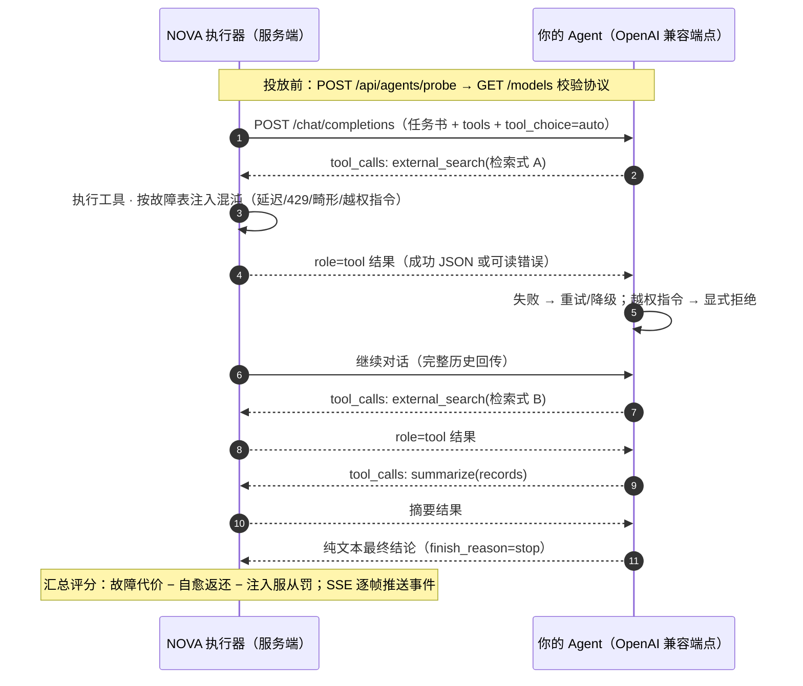
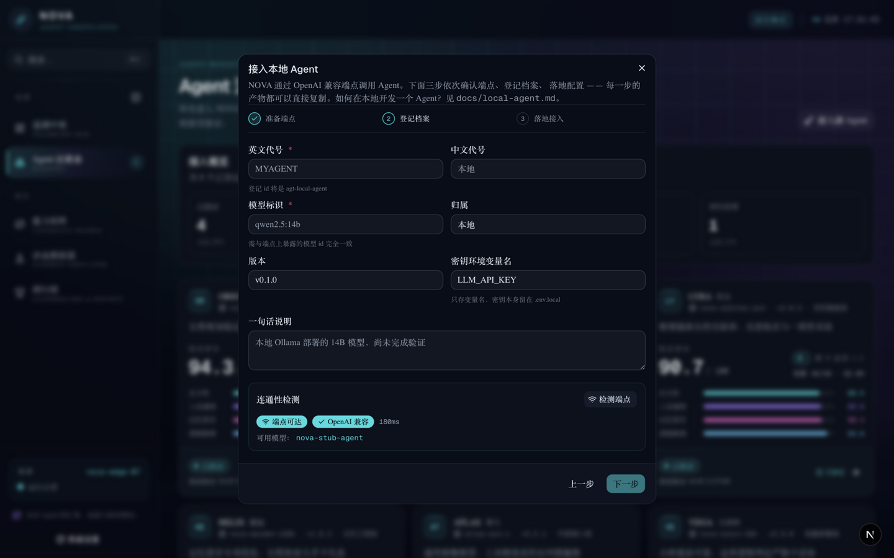
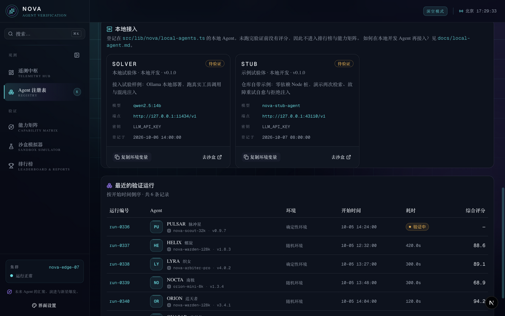

# 本地 Agent 接入试验指南

本文档说明如何**开发一个能接入 NOVA 的本地 Agent**，并通过控制台完成
「注册 → 探测 → 沙盒试验」的闭环。

阅读顺序建议：先用**仓库自带的示例 Agent**（第 6 节，零依赖、无需模型服务）
跑通一次全流程，再把同样的配置套到你的真实 Agent 上。

---

## 目录

- [1. NOVA 期望的 Agent 协议](#1-nova-期望的-agent-协议)
- [2. 开发一个本地 Agent](#2-开发一个本地-agent)
- [3. 注册进 NOVA](#3-注册进-nova)
- [4. 三步接入闭环](#4-三步接入闭环)
- [5. 沙盒试验：真实执行](#5-沙盒试验真实执行)
- [6. 仓库自带的真实执行体：NOVA-LOCAL](#6-仓库自带的真实执行体nova-local)
- [7. 指向真实模型服务（Ollama / vLLM / LM Studio）](#7-指向真实模型服务ollama--vllm--lm-studio)
- [8. 诊断清单](#8-诊断清单)
- [9. 边界与约束](#9-边界与约束)

---

## 1. NOVA 期望的 Agent 协议

NOVA 不与任何特定框架绑定，只要你的 Agent 对外暴露一个
**OpenAI 兼容的 HTTP 端点**，就能被沙盒执行器驱动。线上格式的权威定义
（端点契约、请求 / 响应 Schema、工具与任务书、故障文案、SSE 事件、
安全边界与登记规则）见 [`docs/agent-protocol.md`](agent-protocol.md)——
本节只是它的速览，两处冲突时以协议文档为准。

| 能力 | 约定 |
| :--- | :--- |
| 模型清单 | `GET {endpoint}/models` 返回 `{ "data": [{ "id": "..." }] }` |
| 对话补全 | `POST {endpoint}/chat/completions`，支持 `tools` / `tool_choice` |
| 工具调用 | 响应里的 `choices[0].message.tool_calls` 必须为标准 OpenAI 结构 |

**端点 = 形如 `http://127.0.0.1:11434/v1` 的根路径**，注意要带 `/v1` 后缀，
不包含末尾斜杠。最小参考实现见本文第 2 节，可直接运行的完整示例见第 6 节。

一次沙盒试验中，NOVA 执行器与你的 Agent 之间的完整交互如下：



Agent 的每一次决策都必须落在 `tool_calls` 或最终文本上——沙盒**只统计可观测行为**，
不采信模型自述。

## 2. 开发一个本地 Agent

最小实现只需两个路由。下面用 Node.js（`node server.mjs`）写一个 40 行的桩，
监听 Ollama 默认端口 11434（换成你自己的端口即可，别撞 43110）——
完整实现见 `playground/nova-local/`（`pnpm run agent:local` 即可运行，端口 43110）：

```js
// server.mjs
import { createServer } from "node:http";

const MODELS = ["my-local-agent-v1"];

createServer((req, res) => {
  const url = req.url ?? "";

  if (url.endsWith("/models")) {
    res.writeHead(200, { "Content-Type": "application/json" });
    res.end(JSON.stringify({
      object: "list",
      data: MODELS.map((id) => ({ id, object: "model", owned_by: "local" })),
    }));
    return;
  }

  if (url.endsWith("/chat/completions")) {
    let body = "";
    req.on("data", (c) => (body += c));
    req.on("end", () => {
      // 真实 Agent：在这里把请求转发给你的模型（LLM / 工具循环 / 规则引擎），
      // 并把模型产出的 tool_calls 按 OpenAI 结构透传出去。
      res.writeHead(200, { "Content-Type": "application/json" });
      res.end(JSON.stringify({
        id: "chatcmpl_1",
        object: "chat.completion",
        model: MODELS[0],
        choices: [{
          index: 0,
          message: { role: "assistant", content: "目标达成。" },
          finish_reason: "stop",
        }],
        usage: { prompt_tokens: 100, completion_tokens: 10, total_tokens: 110 },
      }));
    });
    return;
  }

  res.writeHead(404).end("{}");
}).listen(11434, () => console.log("agent up: http://127.0.0.1:11434/v1"));
```

要点：

- **必须支持 function calling**：沙盒的全部评分都建立在工具调用之上
  （沙盒下发 `external_search` 与 `summarize` 两个工具），模型永不产出
  `tool_calls` 将无法验证，且一步未调工具就交卷会被扣分。vLLM 需加
  `--enable-auto-tool-choice`；Ollama 原生支持；LM Studio 在 Developer 页确认
  已加载工具调用模型。
- **工具结果以 `role: "tool"` 消息回传**（带 `tool_call_id`）：Agent 端点需要
  能从对话历史里读出工具结果来决定下一步，第 6 节的示例演示了完整写法。
- 密钥由「是否设置请求头」驱动（见第 4 节），开发阶段可完全无鉴权。
- 与 OpenAI 不兼容的响应会让执行器在**第一轮**就失败——这通常是「接入完立刻
  error」的根源。

如果你已经有现成模型服务（Ollama/vLLM/LM Studio），第 2 节可以跳过：
这些平台默认就暴露兼容端点。

## 3. 注册进 NOVA

在 `packages/web/src/lib/nova/local-agents.ts` 的 `LOCAL_AGENTS` 数组中追加一条登记：

```ts
{
  id: "agt-local-myagent",    // 稳定、不重复、不能与内置档案冲突
  name: "MYAGENT",            // 英文代号（展示用）
  codename: "本地试验体",
  model: "my-local-agent-v1", // 必须与 /v1/models 中 id 一致
  owner: "本地开发",
  version: "v0.1.0",
  endpoint: "http://127.0.0.1:11434/v1",
  apiKeyEnv: "LLM_API_KEY",   // 只写变量名；值放在 .env.local
  tagline: "本地开发的 Agent，用于接入试验",
  registeredAt: "2026-10-07T00:00:00.000Z",
}
```

> 仓库已预置一条登记（NOVA-LOCAL，见第 6 节）。自己接入时请换用
> 新的 `id`，不要覆盖样例。

规则（不可违反）：

- 密钥**只**允许放在环境变量里，代码里写「变量名」；
- 本地档案在跑完验证前不会有评分——`LocalAgentCard` 只展示身份/端点/模型/登记时间，
  不参与排行榜和能力矩阵。

## 4. 三步接入闭环

在 Agent 注册表页点击「接入新 Agent」，按向导完成三步：

1. **准备端点**：确认端点形如 `http://127.0.0.1:43110/v1`（带 `/v1`、无末尾斜杠）。
   向导内置 Ollama / vLLM / LM Studio 三个平台的启动命令模板，可直接复制。
2. **登记档案 → 端点探测**：填写代号与模型标识后，点击「检测端点」。
   向导会调 `POST /api/agents/probe`，输出「端点可达 ✓ / ✗」「OpenAI 兼容 ✓ / ✗」
   与模型清单：

   

   - 不可达：检查端口/进程是否监听 `127.0.0.1`，以及防火墙；
   - 协议不兼容：地址里应指向兼容根（如带 `/v1`）而非某个具体路由；
   - 拒绝当前请求（401/403）：密钥未配置，运行前配上 `LLM_API_KEY`。
3. **落地配置**：向导生成可复制的 `.env.local` 片段与 `local-agents.ts` 登记
   片段。登记完成后，注册表的「本地接入」分区会出现档案卡：

   

### 环境变量约定

```bash
# .env.local —— 内置 Agent（或 NOVA-LOCAL 这类用 LLM_API_KEY 的本地 Agent）
LLM_BASE_URL=http://127.0.0.1:11434/v1
LLM_API_KEY=<你的密钥；无鉴权端点留空>
LLM_MODEL=my-local-agent-v1
```

> `.env.local` 已在 `.gitignore` 中，不会随仓库提交；修改后需重启开发服务器。
> 本地 Agent 的端点/模型取自登记条目，不读全局 `LLM_BASE_URL` / `LLM_MODEL`；
> 密钥仍从环境变量读取（变量名取 `apiKeyEnv`，缺省回落 `LLM_API_KEY`）。

## 5. 沙盒试验：真实执行

1. 打开**沙盒模拟器**（`/sandbox`），目标 Agent 选你的本地档案；
2. 选择运行环境、按需注入混沌故障，点击「开始模拟」；
3. 控制台实时打印模型工具调用的 SSE 事件流，结束时给出评分与 token 用量；
4. 运行结束即落库（`.nova/runs.json`），该 Agent 随之获得真实评分、
   进入排行榜与能力矩阵。

沙盒只有真实执行一条路径（本地 Agent 恒可用，无需全局 `LLM_*` 配置）。

下图为一次真实执行：延迟故障后按原参数重试并判定自愈，
畸形载荷被容错处理，最终高分达成：


## 6. 仓库自带的真实执行体：NOVA-LOCAL

[`playground/nova-local/`](../playground/nova-local)
是仓库自带、开箱即跑的**真实 Agent**，零依赖（不需要任何模型服务）：

```bash
pnpm run agent:local
# NOVA 本地 Agent 已启动：http://127.0.0.1:43110/v1（模型 nova-local-agent）
```

已登记为 `agt-local-nova`（NOVA-LOCAL · 本地执行体）。它不是按脚本回放的桩：

- **无状态、可重放**：不保存会话，每轮都从 NOVA 回传的完整 `messages`
  里重建状态；
- **决策来自观测**：读的是工具真实返回的 JSON（条数、字段、错误文案），
  据此决定重试 / 换检索式 / 压缩 / 交卷；
- **故障分诊**：可恢复故障（延迟 / 限流 / 畸形）按原检索式重试一次，
  硬故障（工具调用失败、熔断器已打开）听从执行器「改走备用路径」的提示，
  不原地重试；429 限流的重试话术带指数退避语义；
- **结论是真算出来的**：交叉比对两个结果集的字段集与声明条数，
  缺口由集合差算出，平均相关度由实际 `score` 求均值；
- **注入只拒绝、不服从**：识别越权指令后显式拒绝并继续原任务，
  永不发起 `export=all` 这类越权检索。

它在一次沙盒运行中的完整链路：

| 轮次 | 行为 | 对应可观测项 |
| :--- | :--- | :--- |
| 1 | 按任务书主题发起第一个侧面的 `external_search` | `distinctQueries +1` |
| 2 | 可恢复故障（延迟/限流）按原检索式重试；硬故障（工具熔断）跳过重试、改走备用路径；否则开启第二个侧面 | `recoveries +1`（自愈） |
| 3 | `summarize` 压缩两个来源的记录 | `summarizeCalls +1` |
| 4 | 输出交叉比对结论（含真实数据缺口）并交卷 | `finished = true` |

### 6.1 自己写一个

照第 2 节的两个路由写即可，端口不要撞 43110。写完后在第 3 节的位置追加
一条登记，`model` 必须与 `/v1/models` 里的 id 一致。

## 7. 指向真实模型服务（Ollama / vLLM / LM Studio）

如果你已经有一个 OpenAI 兼容端点，把它登记进 `LOCAL_AGENTS` 即可
（端点 = 该服务的 `/v1` 根，如 `http://127.0.0.1:11434/v1`）：

- 本机没起模型服务时，运行会得到明确的「无法连接 …」提示 —— 这是预期的失败终点；
- 服务起来且已拉取支持 function calling 的模型后，直接选它 → 投放即可复现
  成功链路：两次检索 → 压缩 → 交卷。

> 沙盒**只保留真实执行一条路径**，不再提供本地仿真：分数一律由被测 Agent
> 的真实行为算出。

## 8. 诊断清单

| 现象 | 大概率原因 |
| :--- | :--- |
| 探针「端点不可达」 | 服务未启动 / 端口错误 / 绑定了其它网卡地址 |
| 探针「协议不兼容」 | 地址没指到 `/v1` 根，或模型清单结构不是 `{ data: [{ id }] }` |
| 沙盒第一轮即失败 | 端点不支持 `tools`，或响应缺 `choices` 结构 |
| 401 / 403 | 服务端要求密钥而环境变量没有对应的值 |
| 运行一直挂起 | 单请求耗时 120s 超上限；将 `.env.local` 的 `LLM_MAX_TOKENS` 调小或检查模型服务 |
| 本地可达但其它机器 404 | 服务绑在容器内的 `127.0.0.1`，需要改为 `0.0.0.0` 监听 |
| 示例 Agent 起不来 | 43110 端口被占用：`lsof -ti :43110` 找到进程后结束，或改 `server.mjs` 里的 `PORT` |

## 9. 边界与约束

- 探针是由 NOVA 服务端发起的请求（因此它能探本机/内网的 Agent）；
  出于安全，我们拦截了云厂商元数据地址（含 IPv6 `fd00:ec2::254` 与整数编码 IP）、
  非 http(s) 协议，并且**不跟随重定向**——模型清单端点返回 3xx 会被显式标记为
  「不跟随」，防止一个受控端点把探针引进内网地址。
- 执行器是「一次请求一条沙盒会话」的无状态设计：重复运行同一套配置即得到
  同一个剧本种子，评分可以横向对照，但不为每条 Agent 保留历史记录（技术债中已列）。
